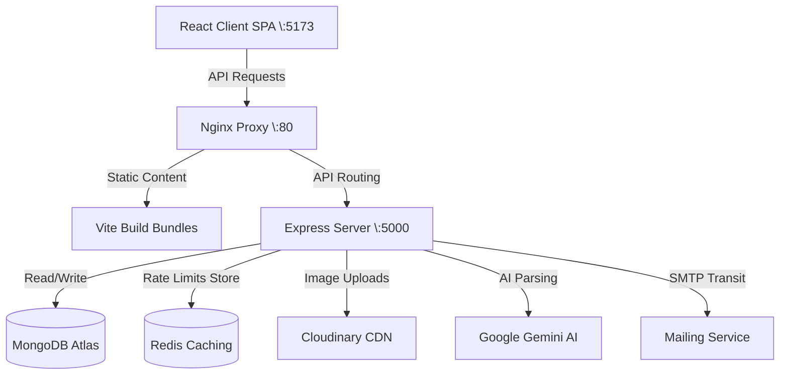

# MaintainIQ - Assets Maintenance & Operations Management Platform

MaintainIQ is a MERN-stack asset maintenance and incident reporting platform designed for facility managers and technicians. It streamlines the lifecycle of corporate assets—from QR-code tracking to automated Gemini AI incident triage, status transitions, maintenance logging, cost telemetry, email notifications, and dashboard telemetry analytics.

---

## 🚀 Key Features

*   **Custom Authentication & RBAC**: Dual-role workflow interface (Admin/Technician). Administative dashboards are hidden from technical users via route guards and Navigation filters.
*   **Asset Lifecycle Management**: Full CRUD panel for assets. Generates unique asset codes, short public slug identifiers, and downloadable, high-fidelity SVG/PNG QR codes.
*   **Public QR Inspection Point**: Guest-facing quick-lookup page. Authenticated access is not required to scan asset QR codes, view current condition/status, or report incident complaints.
*   **Gemini AI Callout Triage**: Automatically parses public descriptions to suggest structured diagnostics:
    *   Synthesized summary titles
    *   Category categorization
    *   Recommended priority levels (Low, Medium, High, Critical)
    *   Possible root-cause checks and initial troubleshooting steps.
    *   Enforces safety check notices if recurring issues occur.
*   **Work Order Auto-Assignment**: Admin auto-assignment binds issues to technicians securely.
*   **Technician Operations Panel**: Technicians log inspection notes, work completed, parts used, cost calculations (cost >= 0 constraints), and upload repairs resolution evidence directly to Cloudinary.
*   **Asset Status Synchronization**: Transitioning issues to "Resolved" automatically resets the parent asset status to "Operational" and verifies future maintenance service dates.
*   **Dashboard Telemetry Analytics**: Admin analytics visualizes total investments, pending tickets, technician distributions, and asset condition percentages.
*   **Global Filters & Search**: Search assets or issues instantly via textual filters, categories, priorities, and condition bounds.

---

## 🛠️ Tech Stack & Integrations

*   **Frontend**: React.js, Tailwind CSS (Vanilla styled), Vite (Build tooling), React-Router-DOM, React Hot Toast (Real-time indicators).
*   **Backend**: Node.js, Express.js, Mongoose, RESTful API architecture.
*   **Database**: MongoDB (Atlas) for storage, Redis (`ioredis` client) for fast rate-limiting.
*   **AI Integration**: Google Gemini AI (Developer APIs).
*   **CDN File Uploads**: Cloudinary APIs for processing evidence photo uploads.
*   **Notification Engine**: Nodemailer (via standard SMTP/Console log fallback channels).
*   **Operations**: Docker + docker-compose (multi-service orchestration), GitHub Actions (automated CI testing).

---

## 📊 Solution Architecture



---

## 📋 Implemented Bonuses

1.  **Rate Limiting & Redis Store**: Applied `express-rate-limit` with `rate-limit-redis`. Configured with a lazy-initialized Redis connection wrapper to gracefully fall back to an in-memory caching store if Redis is unreachable on start.
    *   *Public Issues Endpoint*: Limit 10 requests / minute.
    *   *Auth Endpoints*: Limit 5 requests / minute.
    *   *AI Triage Callouts*: Limit 5 requests / minute.
2.  **Docker Orchestration**: Pre-configured three-tier containerized stack (`docker-compose.yml`) linking backend, frontend (served via Nginx alpine with client-side SPA routing fallback configurations), and a local Redis container.
3.  **Active Email Notifications**: Automated Nodemailer routing. Dispatches emails on technician task auto-assignment (notifying technician inbox) and issue resolution (notifying public reporter if contact email was supplied). Uses exception isolation to ensure SMTP routing failures never block database writes.
4.  **GitHub Actions Continuous Integration**: Scripted `.github/workflows/ci.yml`. Triggers checks on pushes/pull requests to target `main` branch. Exercises dependency installations, ESLint code verification, and Vite compiler builds. Passed with zero errors.

---

## ⚙️ Local Configuration & Setup

### Prerequisites
- Node.js v20+
- MongoDB instance (Local or MongoDB Atlas)
- Redis Server (Optional / Local docker container)

### 1. Clone & Install Dependencies
```bash
git clone https://github.com/HamzaSaeed06/Final_Hackathone_SMIT.git
cd Final_Hackathone_SMIT

# Install Backend Dependencies
cd backend
npm install

# Install Frontend Dependencies
cd ../frontend
npm install
```

### 2. Configure Environment Variables
Create a `.env` file in the `backend/` folder:
```env
PORT=5000
MONGO_URI=your_mongodb_connection_string
JWT_SECRET=your_jwt_signing_token
GEMINI_API_KEY=your_gemini_developer_key
CLOUDINARY_CLOUD_NAME=your_cloudinary_cloud_name
CLOUDINARY_API_KEY=your_cloudinary_api_key
CLOUDINARY_API_SECRET=your_cloudinary_api_key_secret

# Optional Email SMTP setup (defaults to console logging fallback if blank)
SMTP_HOST=smtp.mailtrap.io
SMTP_PORT=2525
SMTP_USER=your_smtp_user
SMTP_PASS=your_smtp_password
SMTP_FROM=noreply@maintainiq.com

# Optional Redis connection (defaults to in-memory fallback if blank)
REDIS_URL=redis://localhost:6379
```

Create a `.env` file in the `frontend/` folder:
```env
VITE_API_URL=http://localhost:5000/api
```

### 3. Database Seeds
Populate the database with a default Admin User before start:
```bash
cd backend
npm run seed:admin
```

### 4. Running the Project (Dev Mode)
Run backend and frontend concurrently in your workspace:
```bash
# In backend/
npm run dev

# In frontend/
npm run dev
```
Open [http://localhost:5173](http://localhost:5173) in your browser.

---

## 🐳 Running with Docker (Recommended)

Orchestrate the entire three-tier stack (Backend + Frontend served via Nginx + Redis) using a single command:
```bash
docker-compose up --build -d
```
The Docker setup binds:
- Main SPA Client: `http://localhost:80`
- REST APIs panel: `http://localhost:5000/api`
- Redis: Port `6379` (Internal container link configuration)

---

## 🔒 Demo Credentials

To test the system role permissions, use the following seeded account profiles:

| Role | Username / Email | Password |
|---|---|---|
| **Admin Manager** | `admin@maintainiq.com` | `AdminPassword123!` |
| **Technician** | Create a technician user under the Admin dashboard, or register a new user under postman. | (Selected on signup) |
